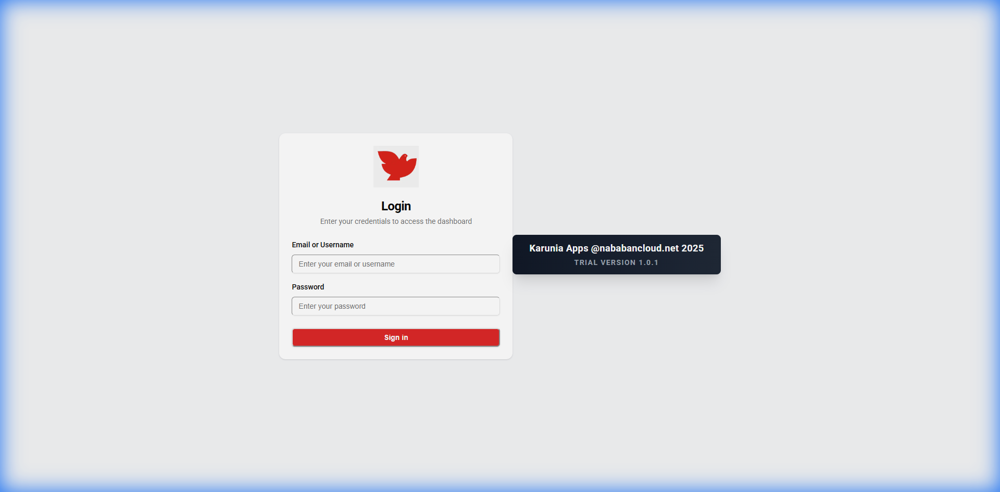
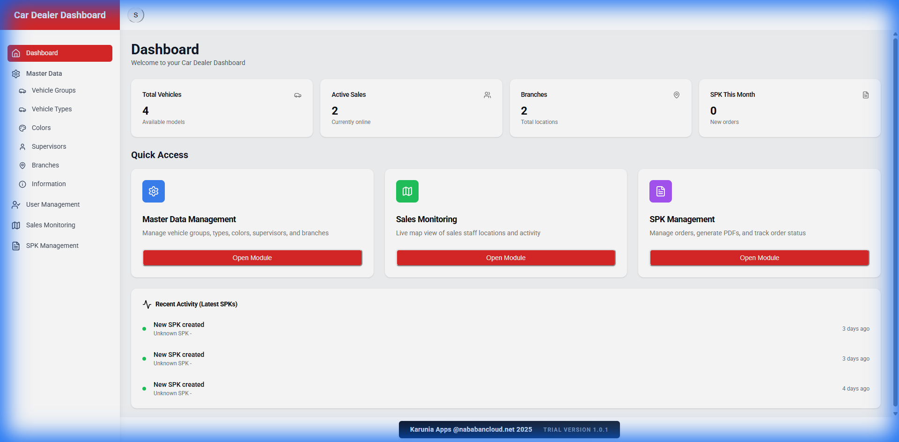

# Karunia Dashboard Application Documentation

## 1. Overview
**Karunia Dashboard** is a high-performance admin dashboard for managing automotive dealer operations. It is built using **Next.js 14** (App Router) as a Static Site (SPA) for speed, utilizing a Dockerized Nginx setup for production stability.

### Key Screens

#### Login Screen
Features a secure, branded login interface with role-based validation (ADMIN only).


#### Admin Dashboard
Provides real-time sales overview, recent activity tracking, and quick access to management modules.


---

## 2. Architecture & Tech Stack

### Frontend Core
*   **Framework**: Next.js 14 (SPA / Static Export)
*   **Language**: TypeScript
*   **State**: React Context (`AuthContext`)
*   **UI Library**: Shadcn UI + Tailwind CSS
*   **Routing**: Next.js App Router (Client-side usage)

### Integration
*   **Backend**: Strapi CMS (`NEXT_PUBLIC_STRAPI_URL`)
*   **Maps**: Google Maps JS API for Sales Monitoring
*   **PDF**: `@react-pdf/renderer` for SPK Generation

### Deployment Strategy (Dockerized SPA)
To solve environment mismatches, we use a custom **Docker build process**:
1.  **Container**: `node:22-alpine` runs the build.
2.  **Output**: `npm run build` generates static files in `out/`.
3.  **Serving**: `nginx:alpine` serves `out/` on **Port 3000**.
4.  **Routing**: Nginx handles SPA fallbacks (404 -> index.html).

---

## 3. Directory Structure

```
/
├── docs/images/            # Documentation Assets
├── public/                 # Web Assets (favicon, logos)
├── src/
│   ├── app/                # Application Routes
│   │   ├── auth/           # Login Logic
│   │   ├── dashboard/      # Protected Admin Routes
│   │   └── layout.tsx      # Root Provider Setup
│   ├── components/         # Shared UI Components
│   │   ├── ProtectedRoute.tsx # Auth Guard
│   │   └── DashboardLayout.tsx # Sidebar/Header
│   ├── contexts/           # Auth State Management
│   ├── services/           # Axios API Layer
│   └── types/              # TypeScript Models
├── Dockerfile              # Production Build Config
├── nginx.conf              # SPA Routing Config
└── DEPLOY_COOLIFY.md       # Deployment Instructions
```

---

## 4. Operational Flows

### Authentication & Security
*   **Login**: Authenticates against Strapi. Checks for `role_custom === 'ADMIN'`.
*   **Token**: JWT stored in localStorage.
*   **Interceptor**: automatically adds `Authorization` headers.
*   **Guard**: `ProtectedRoute` prevents unauthorized access to `/dashboard`.
*   **Timeout**: Dashboard data fetching has a 15s safety timeout to prevent hanging.

### Deployment (Coolify)
**Crucial**: Do not use "Nixpacks". Use **Dockerfile** build pack.
*   **Port**: 3000
*   **Command**: (Handled by Dockerfile)

---

## 5. Development Guide
### Prerequisite
*   Node.js 22+
*   Backend API Running (Strapi)

### Quick Start
```bash
# Install Dependencies
npm install

# Run Development Server
npm run dev
# Access: http://localhost:3000
```

### Production Build (Local Test)
```bash
npm run build
# Check 'out' folder for static files
```
